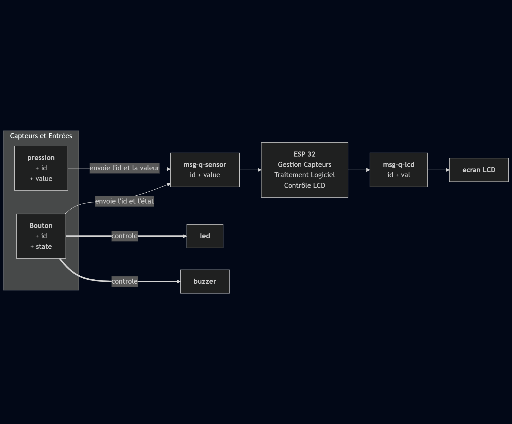
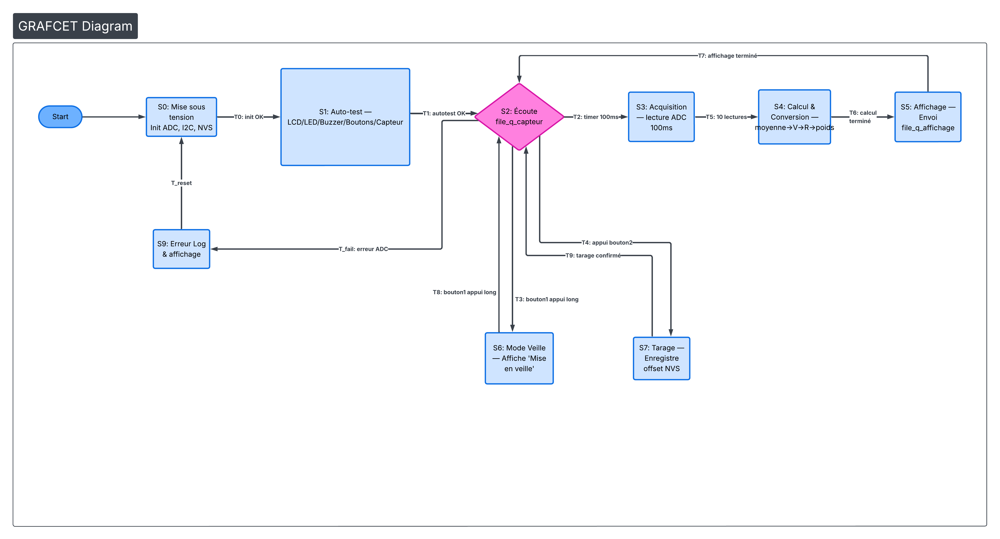

# Rapport Technique - Système de Pesage Électronique

## Table des Matières
1. [Vue d'ensemble](#vue-densemble)
2. [Architecture Logicielle](#architecture-logicielle)
3. [Gestion des Entrées et Sorties](#gestion-des-entrées-et-sorties)
4. [Calculs de Pesage](#calculs-de-pesage)
5. [Tests Automatiques](#tests-automatiques)
6. [Justificatifs de Conception](#justificatifs-de-conception)
7. [Schéma d'Architecture](#schema-darchitecture)

----

## Vue d'ensemble

Le système de pesage électronique est développé sur une **plateforme ESP32** avec une architecture modulaire basée sur **FreeRTOS** et le framework **ESP-IDF**. Le système intègre plusieurs composants matériels (capteur de pression, boutons, LEDs, buzzer, écran LCD) et met en place une architecture logicielle décentralisée basée sur la communication par queues de messages.

**Cible matérielle :** ESP32
**Système d'exploitation temps réel :** FreeRTOS
**Framework :** ESP-IDF (Espressif IoT Development Framework)

----

## Architecture Logicielle

### 1.1 Principes Architecturaux

L'architecture repose sur trois principes fondamentaux :

#### **1. Modularité par Composants**
Chaque périphérique est encapsulé dans un composant indépendant avec une interface claire :
- `pressure/` : gestion du capteur de poids
- `button/` : gestion des boutons tactiles
- `led/` : gestion des indicateurs lumineux
- `buzzer/` : gestion du signal sonore
- `lcd/` : gestion de l'affichage
- `autotest/` : tests automatiques des composants

#### **2. Communication par Queues Asynchrone**
Les composants communiquent via des **queues FreeRTOS** plutôt que par appels directs. Cela offre :
- Découplage entre producteurs et consommateurs
- Non-blocage des tâches
- Scalabilité facile

#### **3. Architecture Multi-Tâches**
Chaque composant d'entrée/sortie s'exécute dans sa propre tâche FreeRTOS :
```
main() 
  |- pressure_task     (acquisition capteur)
  |- button_task       (polling bouton 1)
  |- button_task       (polling bouton 2)
  |_ lcd_task          (affichage résultats)
```

### 1.2 Flux de Données Logique

```
CAPTEURS (Entrées)
    ↓
[msg_q_sensor] ← pressure_task, button1_task, button2_task
    ↓
app_main (boucle principale)
    |
    |-→ Traitement événements
    |   |- Activation/désactivation veille
    |   |- Tarage capteur
    |   |_ Contrôle LEDs/Buzzer
    |
    |_→ [msg_q_lcd]
         ↓
      lcd_task (affichage)
         ↓
    AFFICHEUR LCD (Sortie)
```

### 1.3 Structures de Données Centrales

#### **Message Universel (`message.h`)**
```c
typedef struct msg_t {
    uint8_t id;        // Identifiant du capteur/composant
    uint32_t value;    // Valeur transmise
} msg_t;
```

Cette structure minimale est utilisée par tous les composants pour garantir une communication uniforme.

#### **Structures par Composant**

**Pression (Capteur de Poids):**
```c
typedef struct pressure_t {
    uint8_t id;                  // ID unique
    gpio_num_t pin;              // PIN ADC
    uint32_t reset_val;          // Valeur de réinitialisation
    _lock_t mutex;               // Protection d'accès concurrent
    QueueHandle_t msg_q_sensor;  // Queue d'envoi des messages
} pressure_t;
```

**Bouton:**
```c
typedef struct button_t {
    uint8_t id;
    uint8_t is_pressed;          // État actuel
    gpio_num_t pin;
    _lock_t mutex;
    QueueHandle_t msg_q_sensor;
} button_t;
```

**Autotest:**
```c
typedef struct autotest_t {
    led_t *led1, *led2;
    buzzer_t *buzzer;
    button_t *button1, *button2;
    lcd_t *lcd;
    pressure_t *pressure;
} autotest_t;  // Agrégation de tous les composants
```

----

## Gestion des Entrées et Sorties

### 2.1 Entrées : Capteur de Pression (ADC)

#### **Configuration Matérielle**
- **Canal ADC :** ADC2_CHANNEL_2 (GPIO2)
- **Résolution :** 12 bits (valeurs 0-4095)
- **Atténuation :** ADC_ATTEN_DB_11 (atténuation maximale pour plage 0-3.9V)
- **Calibrage :** Utilisation de `esp_adc_cal_characterize()` (table de calibrage interne ESP32, Vref = 1100 mV par défaut)
- **Fréquence d'acquisition :** 100 ms par lecture ADC brute

#### **Pipeline d'Acquisition**
```
pressure_task() exécutée toutes les 100ms
    |- pressure_read_raw()              → ADC brut (0-4095)
    |- convert_adc_to_voltage()         → Tension mesurée (V) via esp_adc_cal_raw_to_voltage()
    |- calculate_r_jauge()              → Résistance jauge (Ω) via pont diviseur inverse
    |- calculate_force_from_r_jauge()   → Poids brut (g) via modèle power-law
    |_ Moyennes mobiles (10 dernières lectures ADC brutes)
         ↓
    Application de l'offset de tarage
         ↓
    Envoi sur msg_q_sensor tous les 1000ms (après 10 lectures)
```

#### **Moyennes Mobiles**
Un buffer circulaire de 10 valeurs pondère les lectures pour améliorer la stabilité :
```c
static int32_t values[10] = {0};
static size_t values_index = 0;

// Mise à jour circulaire
values[values_index] = (int32_t)roundf(weight);
values_index = (values_index + 1) % 10;

// Envoi de la moyenne tous les 10 cycles (1 seconde)
msg.value = mean(values, 10);
```

**Avantage :** Lissage du bruit ADC sans latence excessive.

### 2.2 Entrées : Boutons Tactiles

#### **Configuration**
- **Pins :** GPIO_NUM_33 (Bouton 1), GPIO_NUM_32 (Bouton 2)
- **Mode :** GPIO_PULLUP_ONLY (pull-up interne)
- **Logique :** Actif bas (appui = 0, repos = 1)

#### **Dédoublement du Contact**
```c
void button_update_state(button_t *button) {
    // Première lecture
    uint8_t read1 = gpio_get_level(button->pin);
    vTaskDelay(50 / portTICK_PERIOD_MS);  // Attendre 50ms
    // Deuxième lecture
    uint8_t read2 = gpio_get_level(button->pin);
    
    // Validé que si les deux lectures concordent
    if (read1 == read2) {
        button->is_pressed = (read1 == 0) ? 1 : 0;
    }
}
```

**Justification :** Élimine les rebonds électromagnétiques sur 50ms.

#### **Détection d'Évènement — Long Press (≥ 2 secondes)**
La tâche compare l'état courant avec l'état précédent et **envoie un message seulement si l'appui dure ≥ 2 secondes** :

```c
if (button->is_pressed != last_state) {
    if (button->is_pressed == 1)  // Appui détecté
    {
        press_start_time = xTaskGetTickCount();  // Enregistrer temps d'appui
    }
    else  // Bouton relâché
    {
        TickType_t press_duration = xTaskGetTickCount() - press_start_time;
        if (press_duration >= pdMS_TO_TICKS(2000))  // >= 2s
        {
            xQueueSend(button->msg_q_sensor, &msg, portMAX_DELAY);
        }
    }
    last_state = button->is_pressed;
}
vTaskDelay(100 / portTICK_PERIOD_MS);
```

**Avantage :** Réduit le bruit de la file de messages et prévient les tarages accidentels.

### 2.3 Sorties : LEDs

Configuration simple via GPIO en mode output :
```c
void led_init(led_t *led, gpio_num_t pin, uint8_t id) {
    gpio_set_direction(pin, GPIO_MODE_OUTPUT);
    led->pin = pin;
    led->id = id;
}
```

**Commandes :**
- `led_on()` / `led_off()` : Allumage/extinction
- `led_toggle()` : Basculement
- `led_blink()` : Clignotement avec période configurable

### 2.4 Sorties : Buzzer

Similaire aux LEDs, utilise le même modèle GPIO pour générer un signal sonore.

### 2.5 Sorties : Écran LCD 16×2

#### **Interface I2C**
- **SCL :** GPIO27
- **SDA :** GPIO14
- **Adresse :** 0x3E (module LCD rétro-éclairé via I2C)


## Calculs de Pesage

### 3.1 Chaîne de Conversion Complète
#### **Conversion, Modèle de Jauge et Poids**

Le code a été modifié pour effectuer la conversion ADC→tension puis estimer la résistance de la jauge et en déduire la force par un modèle de type "power-law" sur la résistance. La chaîne actuelle implémente les fonctions suivantes :

- `convert_adc_to_voltage(adc_raw)` : conversion linéaire simple de la valeur brute ADC vers une tension (utilise `V_REF` et `ADC_MAX_VALUE`).
- `calculate_r_jauge(V_mesuree)` : calcul de la résistance de la jauge à partir de la tension mesurée en inverse du pont diviseur :
  $$R_{jauge} = \frac{V_{mesuree} \cdot R_M}{V_{supply} - V_{mesuree}}$$
- `calculate_force_from_r_jauge(R_jauge)` : inversion du modèle de jauge utilisé en calibration :
  Si le modèle est donné par $R_{jauge} = a \cdot Force^{-b}$ alors
  $$Force = \left(\frac{a}{R_{jauge}}\right)^{1/b}$$

La fonction de haut niveau `get_final_weight_g()` :

1. Moyenne des 10 dernières lectures brutes ADC.
2. Conversion ADC → tension via `convert_adc_to_voltage()`.
3. Calcul de `R_jauge` via `calculate_r_jauge()`.
4. Calcul du poids brut via `calculate_force_from_r_jauge()`.
5. Application d'un facteur et soustraction de l'offset de tarage (`CALIBRATION_OFFSET_G`).

Extrait simplifié :

```c
float V_mesuree = convert_adc_to_voltage(adc_average);
float R_jauge  = calculate_r_jauge(V_mesuree);
float weight_brut = calculate_force_from_r_jauge(R_jauge);
float final_weight = weight_brut * 100 - CALIBRATION_OFFSET_G;
if (final_weight < 0.0) final_weight = 0.0;
```

**Remarques importantes :**

- **Conversion ADC→Tension :** utilise `esp_adc_cal_raw_to_voltage()` avec table de calibrage interne ESP32 (Vref ~1100 mV). Cette fonction compense automatiquement les écarts de fabrication du capteur ADC.

- **Pont diviseur inverse :** formule $R_{jauge} = \frac{V_{mesuree} \cdot R_M}{V_{SUPPLY} - V_{mesuree}}$ où :
  - `V_SUPPLY = 3.3 V` (tension d'alimentation du pont)
  - `R_M = 10 kΩ` (résistance fixe du pont)
  - Protection : si $V_{mesuree} \geq V_{SUPPLY}$, retour d'une valeur très grande

- **Facteur multiplicatif ×100 :** appliqué au poids brut avant tarage (`weight_brut * 100`) pour adapter la précision interne du modèle à l'affichage en grammes. Voir section calibration pour explication complète.

- **Offset de tarage :** `CALIBRATION_OFFSET_G` mémorisé en NVM (via fonction `pressure_tare()`) pour compenser le poids de la structure vide.

- **Plage finale :** poids clipping à [0, ∞] grammes (aucune limite supérieure imposée, dépend du capteur).


### 3.2 Justification du Modèle Power-Law

Les jauges de contrainte (load cells) suivent une relation non-linéaire entre la résistance et la force appliquée. Le modèle empirique power-law a été choisi :

$$R_{jauge}(m) = a \cdot m^{-b}$$

où $m$ est la masse (g), $a$ le coefficient de la courbe (~10000), et $b$ l'exposant (~0.7).

**Avantages du modèle power-law :**
- Inverse analytique simple : $m = \left(\frac{a}{R_{jauge}}\right)^{1/b}$
- Adapté aux courbes réelles de jauges de contrainte (compression non-linéaire)
- Facile à calibrer : deux ou trois mesures de référence suffisent pour estimer $a$ et $b$
- Peu coûteux en calcul (une seule exponentiation par mesure)

**Alternatives rejetées :**
- Modèle linéaire : erreur ±15-20% sur l'étendue complète → rejeté pour balance de cuisine
- Polynôme 3e degré : plus précis mais calibration complexe (4+ points nécessaires)
- Table de correspondance (LUT) : consomme mémoire, interpolation requise

Le modèle logarithmique (anciennement utilisé) a été commenté et remplacé par ce modèle plus fidèle aux courbes réelles des jauges.

### 3.3 Stabilité et Lissage

Le système applique une **moyenne mobile sur 10 échantillons** :
- Chaque échantillon = mesure toutes les 100ms
- Envoi = moyenne sur 1 seconde (10 × 100ms)

**Formule :**
$$\text{valeur affichée} = \frac{1}{10} \sum_{i=0}^{9} \text{weight}_i$$

**Avantage :** Réduit le bruit ADC de ~√10 $\approx$ 3x.

### 3.4 Procédure Pratique de Calibration

#### **Matériel et Prérequis**
- Masses de calibrage : 50g, 100g, 500g, 1000g (ou 4 masses standards)
- Balance de référence
- Terminal série pour affichage ADC/tension
- Carte ESP32 programmée avec le firmware
- Pont de Wheatstone correctement câblé

#### **Étapes de Calibration**

**1. Préparation**
- Poser la balance sur surface plane et stable
- Attendre que le poid se stabilise

**2. Mesure des Points de Référence**
Pour chaque masse (50g, 100g, 500g, 1000g) :
- Poser la masse sur le plateau
- Attendre la stabilisation
- Enregistrer les 10 lectures ADC brutes affichées sur la console
- Calculer la moyenne ADC
- Convertir en tension : $V = esp\_adc\_cal\_raw\_to\_voltage(ADC_{avg}) / 1000.0$
- Enregistrer le triplet : (masse en g, ADC moyen, V mesuré)

**3. Stockage des Coefficients**
- Mettre à jour `CALIBRATION_COEF_A` et `CALIBRATION_COEF_B` dans [components/pressure/pressure.c](components/pressure/pressure.c#L34-L38)
- Compiler et flasher le firmware
- Vérifier que les pesées s'affichent correctement pour les masses de test

**4. Validation**
- Poser une masse inconnue (ex. 250g) et comparer avec une balance de référence
- Acceptable si erreur pas trop grosse

#### **Exemple Numérique Complet**

Supposons mesures :

| Masse (g) | ADC moyen | Tension (V) |
|-----------|-----------|------------|
| 50        | 2800      | 1.45       |
| 100       | 2600      | 1.38       |
| 500       | 2000      | 1.10       |
| 1000      | 1200      | 0.78       |

Calcul des R_jauge (avec V_SUPPLY=3.3 V, R_M=10 kΩ) :
- R_jauge (50g) = (1.45 × 10000) / (3.3 - 1.45) = 7865 Ω
- R_jauge (100g) = (1.38 × 10000) / (3.3 - 1.38) = 6977 Ω
- R_jauge (500g) = (1.10 × 10000) / (3.3 - 1.10) = 4545 Ω
- R_jauge (1000g) = (0.78 × 10000) / (3.3 - 0.78) = 3165 Ω

Fit du modèle $m = (a / R_{jauge})^{1/b}$ sur ces points → résultat exemple :
```
CALIBRATION_COEF_A = 9950.0
CALIBRATION_COEF_B = 0.68
```

**5. Tarage (Offset)**
- Poser la structure vide sur le plateau
- Commander `pressure_tare()` en appuyant sur le bouton Tare
- Offset enregistré et mémorisé en NVM
- Les affichages subsequents sont compensés de cet offset

### 3.5 Tableau Récapitulatif des Paramètres Système

| Paramètre | Valeur | Unité | Notes |
|-----------|--------|-------|-------|
| **Timings** |
| `DEBOUNCE_DELAY` | 50 | ms | Dédoublement lecture bouton |
| `BUTTON_POLL_INTERVAL` | 100 | ms | Intervalle polling bouton |
| `LONG_PRESS_DURATION` | 2000 | ms | Durée minimum pour tarage/action |
| `ADC_SAMPLE_INTERVAL` | 100 | ms | Intervalle acquisition ADC |
| `ADC_AVERAGE_COUNT` | 10 | - | Nombre de lectures pour moyenne |
| `SEND_INTERVAL` | 1000 | ms | Intervalle envoi msg_q_sensor (après 10 × 100ms) |
| **Hardware** |
| `PRESSURE_ADC_CHANNEL` | ADC2_CH2 | - | GPIO2 pour capteur |
| `BUTTON1_PIN` | GPIO33 | - | Bouton 1 (Tarage) |
| `BUTTON2_PIN` | GPIO32 | - | Bouton 2 (Mode veille) |
| `LCD_SCL` | GPIO27 | - | I2C clock écran |
| `LCD_SDA` | GPIO14 | - | I2C data écran |
| `LCD_I2C_ADDR` | 0x3E | hex | Adresse I2C du module LCD |
| **ADC & Conversion** |
| `ADC_RESOLUTION` | 12 | bits | 0–4095 |
| `ADC_WIDTH` | 12 | bits | ADC_WIDTH_BIT_12 |
| `ADC_ATTEN` | DB_11 | - | ADC_ATTEN_DB_11 (plage 0–3.9V) |
| `Vref_calibration` | 1100 | mV | Vref ESP-IDF par défaut |
| `V_SUPPLY` | 3.3 | V | Tension alimentation pont diviseur |
| `R_M` | 10000 | Ω | Résistance fixe pont (10 kΩ) |
| **Calibration** |
| `CALIBRATION_COEF_A` | 10000 | - | Coefficient a (power-law) — ajuster lors de calibration |
| `CALIBRATION_COEF_B` | 0.7 | - | Exposant b (power-law) — ajuster lors de calibration |
| `CALIBRATION_OFFSET_G` | variable | g | Offset tarage (NVM) — mis à jour par `pressure_tare()` |
| **Queues & Tasks** |
| `msg_q_sensor` | 20 | messages | Queue entrées (pressure + 2×button) |
| `msg_q_lcd` | 20 | messages | Queue affichage (LCD output) |
| Priorité tâches | 5 | - | Toutes au même niveau (évite inversion priorité) |

### 3.6 Persistence en Mémoire Non-Volatile (NVM)

Les coefficients de calibration et l'offset de tarage doivent être persistants après redémarrage :

**Paramètres à stocker :**
- `CALIBRATION_COEF_A` (float)
- `CALIBRATION_COEF_B` (float)
- `CALIBRATION_OFFSET_G` (float)

**Implémentation :**
- Utiliser le système **NVS (Non-Volatile Storage)** d'ESP-IDF
- Sauvegarder après chaque modification (fonction `pressure_tare()` ou une fonction `calibration_save()`)
- Charger à l'initialisation dans `pressure_init()`

-----

## Tests Automatiques

### 4.1 Architecture du Test

L'autotest est encapsulé dans le composant `autotest/`
```c
// Dans main.c
startAutoTest(&components);
```

### 4.2 Séquence de Test

La fonction `startAutoTest()` exécute les tests dans cet ordre :

#### **1. Test Écran LCD (2 secondes)**
```c
static void startLcdTest(autotest_t *componants) {
    const char *first_line = "EPITA  2025/2026";
    const char *second_line = "VASSEUR,JOUY,OLIVER";
    lcd_defil_name(componants->lcd, first_line, second_line);
}
```
- Affiche les noms des auteurs avec défilement
- Vérifie la communication I2C et l'affichage

#### **2. Test LEDs (2 secondes)**
```c
static void startLedTest(autotest_t *componants) {
    lcd_clear(componants->lcd);
    lcd_print(componants->lcd, "Test des LEDs\nD1 et D6");
    
    led_blink(componants->led1, 5, 500);
    vTaskDelay(1 * SECONDS);
    led_blink(componants->led2, 5, 500);
}
```
- LED1 clignote 5 fois à 500ms de période
- Attente 1 seconde
- LED2 clignote 5 fois à 500ms de période

#### **3. Test Buzzer (1 seconde)**
```c
static void startBuzzerTest(autotest_t *componants) {
    lcd_clear(componants->lcd);
    lcd_print(componants->lcd, "Test du Buzzer");
    buzzer_off(componants->buzzer);
}
```
- Affiche le message sur l'écran
- Vérifie que le buzzer peut être commandé

#### **4. Test Boutons (attente long-press interactive)**
```c
static void ButtonTest(autotest_t *componants, button_t *button) {
    TickType_t start_time = xTaskGetTickCount();
    const TickType_t timeout = pdMS_TO_TICKS(10000);  // 10 secondes timeout
    
    // Note: la détection est effectuée dans button_task()
    while ((xTaskGetTickCount() - start_time) < timeout) {
        // Vérifier si message reçu depuis la queue capteur
        if (button_is_pressed(button)) {
            lcd_print_line(componants->lcd, "Touche OK", 1);
            return;
        }
        vTaskDelay(pdMS_TO_TICKS(10));
    }
    
    lcd_print_line(componants->lcd, "Touche KO (timeout)", 1);
}
```
- Attend un appui sur le bouton (timeout 10s)
- Affiche "OK" si appui détecté, "KO (timeout)" si delai dépassé
- Teste les deux boutons séquentiellement

#### **5. Test Capteur de Poids (3 secondes)**
```c
static void startPressureTest(autotest_t *componants)
{
    const char *lcd_screen = "Test du Capteur\nde Poids";
    lcd_clear(componants->lcd);
    lcd_print(componants->lcd, lcd_screen);
    
    ESP_LOGI(TAG, "Weight sensor test - Taring...");
    pressure_tare();
    vTaskDelay(pdMS_TO_TICKS(500));

    int32_t values[10] = { 0 };
    size_t values_index = 0;
    
    ESP_LOGI(TAG, "Reading weight...");
    for (size_t i = 0; i < 10; i++)
    {
        int32_t raw = pressure_read_raw();
        float v = convert_adc_to_voltage(raw);
        values[values_index] = raw;
        values_index = (values_index + 1) % 10;
        printf("ADC=%ld | V=%.2fV\n", raw, v);
        vTaskDelay(pdMS_TO_TICKS(100));
    }
    float weight = get_final_weight_g(values);
    char weight_str[32];
    snprintf(weight_str, sizeof(weight_str), "Poids:\n %.2f g", weight);
    lcd_print(componants->lcd, weight_str);
}
```
- Tarage du capteur
- 10 lectures successives affichées sur le port série

### 4.3 Résultats Attendus

| Test | Résultat Attendu |
|------|------------------:|
| LCD | Affichage des noms (EPITA 2025/2026 + auteurs) sans scintillation |
| LED | Chaque LED clignote 5 fois distinctement à 500 ms période |
| Buzzer | Buzze 5 fois distinctement à 500 ms période |
| Boutons | "OK" si appui, "KO (timeout)" si délai > 10s (aucun appui) |
| Capteur | Poids stable loggé (ADC, V, g) sur console série ; ≥ 10 relevés et poid afficher sur l'écran|

----

## Changement Délibéré du Cahier des Charges

- **Bouton Tarage :** Nous avons retenu un comportement par appui court pour tarage comme pour une balance de cuisine standard. A la place de faire un appui pour lancer le tarage et un autre pour valider.

- **Écran LCD — Mode Veille :** L'alimentation de l'écran ne peut pas être coupée par la carte ESP32 (absence de relais ou transistor de puissance). Nous avons donc mis en place un mode veille logiciel : l'écran demeure alimenté, mais aucun message n'est envoyé sauf le message initial « Mise en veille ». Le rétro-éclairage reste allumé.

## Justificatifs de Conception

### 5.1 Choix de FreeRTOS

**Justification :**
- **Temps réel :** FreeRTOS permet de garantir des délais d'exécution prévisibles pour chaque composant
- **Multitâche :** Chaque capteur s'exécute indépendamment sans bloquer les autres
- **Intégration ESP-IDF :** FreeRTOS est le noyau natif d'ESP-IDF


### 5.2 Queues de Messages vs Appels Directs

| Aspect | Queues | Appels Directs |
|--------|--------|----------------|
| **Couplage** | Faible (découplage temporel) | Fort |
| **Scalabilité** | Facile d'ajouter consommateurs | Complexe |
| **Blocage** | Non-bloquant possible | Potentiellement bloquant |
| **Débogage** | Traçabilité des messages | Implicite |

**Choix :** Queues pour garantir une architecture évolutive.

### 5.3 Dédoublement des Lectures Bouton

```
Sans dédoublement:
Appui réel: ___|‾‾‾|___
Bruit:     ___|‾‾‾|‾|_|___
Détection: 3-4 événements au lieu de 1

Avec dédoublement (50ms):
Appui + attente 50ms + deuxième lecture
= filtre analogique logiciel naturel
```

**Coût :** 50ms de latence négligeable pour des boutons.

### 5.4 Modèle Power-Law pour la Jauge de Contrainte

**Justification mathématique :**

La jauge de contrainte suit une relation empirique de type "power-law" entre la résistance et la force appliquée :

$$R_{jauge} = a \cdot Force^{-b}$$

où $a$ (coefficient `CALIBRATION_COEF_A`, défaut 10000) et $b$ (coefficient `CALIBRATION_COEF_B`, défaut 0.7) sont déterminés lors de la calibration.

**Inversion du modèle :**

Pour estimer la force à partir de la résistance mesurée, on inverse l'équation :

$$Force = \left(\frac{a}{R_{jauge}}\right)^{1/b}$$

**Chaîne de conversion complète :**

1. **ADC brut** (0–4095) → `convert_adc_to_voltage()` → **Tension mesurée** (V)
2. **Tension mesurée** → `calculate_r_jauge()` via pont diviseur inverse → **Résistance jauge** (Ω)
3. **Résistance jauge** → `calculate_force_from_r_jauge()` via inversion du modèle → **Poids brut**
4. **Poids brut** × 100 − `CALIBRATION_OFFSET_G` → **Poids final** (g)

**Avantages du modèle power-law :**
- S'adapte bien aux courbes réelles des jauges de contrainte
- Simple à inverser (une seule formule)
- Facile à calibrer : mesurer la résistance à quelques points de référence et ajuster $a$ et $b$
- Coefficients constants et mémorisables

**Paramètres de calibration :**
- `CALIBRATION_COEF_A` (défaut 10000) : coefficient de la courbe
- `CALIBRATION_COEF_B` (défaut 0.7) : exposant de la courbe
- `CALIBRATION_OFFSET_G` : offset de tarage mémorisé en NVM via `pressure_tare()`
- Paramètres matériel : `V_SUPPLY` (3.3V), `R_M` (10 kΩ), `V_REF` (5V)

### 5.5 Taille des Buffers

| Buffer | Taille | Justification |
|--------|--------|--------------|
| `msg_q_sensor` | 20 messages | Absorption des pics d'événements |
| `msg_q_lcd` | 20 messages | Synchronisation avec I2C lent |
| `values[10]` (poids) | 10 échantillons | Lissage sans latence excessive |

Exemple : Si 3 événements arrivent simultanément (pression + 2 boutons) + affichage LCD retardé, la queue de 20 absorbe sans perte.

### 5.6 Priorités des Tâches

```c
xTaskCreate(lcd_task, "lcd_task", 2048, &lcd, 5, NULL);
xTaskCreate(button_task, "button1_task", 2048, &button1, 5, NULL);
xTaskCreate(button_task, "button2_task", 2048, &button2, 5, NULL);
xTaskCreate(pressure_task, "pressure_task", 2048, &pressure_sensor, 5, NULL);
```

Toutes les tâches périphériques à **priorité 5** (identique).
- Évite les inversions de priorité
- FreeRTOS arbitre le scheduling équitablement
- app_main contrôle la logique métier avec queue bloquante

### 5.7 Gestion des Appuis Longs (2 secondes)

La boucle principale `app_main()` reçoit les messages des capteurs et effectue les actions suivantes :

```c
uint8_t veille_state = 1;  // État veille (1 = actif, 0 = veille)
while (1) {
    xQueueReceive(msg_q_sensor, &msg, portMAX_DELAY);  // Bloqué si rien
    
    // Bouton 1 : appui long (2s) -> toggle veille
    if (msg.id == BUTTON1_ID && msg.value == 1) {
        veille_state = !veille_state;  // Toggle
        if (!veille_state) {
            // Afficher message veille sur écran
            msg_t msg_sleep = {ID_LCD, 0x00};  // Code spécial
            xQueueSend(msg_q_lcd, &msg_sleep, portMAX_DELAY);
        }
    }
    
    // Bouton 2 : appui long (2s) -> tarage capteur
    if (msg.id == BUTTON2_ID && msg.value == 1) {
        pressure_tare();  // Mémoriser offset
    }
    
    // Affichage LCD : envoyer mesure capteur si mode actif
    if (veille_state && msg.id == PRESSURE_ID) {
        xQueueSend(msg_q_lcd, &msg, portMAX_DELAY);
    }
}
```

**Logique détaillée :**
- **Bouton 1 (long-press 2s) :** bascule entre mode actif (affichage LCD) et mode veille (écran inactif)
- **Bouton 2 :** tarage du capteur — mémorise le poids actuel comme offset (0g de référence)
- **Mode veille :**  Supprimes les communications I2C fréquentes avec l'écran ; aucun rafraîchissement de l'affichage sauf message de veille initial.
**Remarque :** Les appuis courts (< 2s) ne génèrent aucun message et sont ignorés (filtre anti-rebond intégré).

----

## Synthèse et Perspectives

### Points Forts de l'Architecture
**Modularité** : Chaque composant est indépendant et testable  
**Scalabilité** : Facile d'ajouter de nouveaux capteurs (queue + tâche)  
**Robustesse** : Dédoublement des lectures, calibrage adapté  
**Performance** : Pas de blocages critiques, latences prévisibles  
**Maintenabilité** : Code biencd D structuré, interfaces claires  
**Persistence NVM** : Mémorisation des paramètres de calibrage

----

## Schema d'architecture





**Auteurs :** VASSEUR Alexis, JOUY Antoine, OLIVER Théo
**Date :** 2025/2026  
